# Help Desk Api

## Login com usuário administrador

Ao criar a API criamos um usuário admin padrão.

E ao logarmos com esse usuário recebemos um token que podemos usar para criar novos usuários.

Selecionamos o método post e definimos o endpoint.

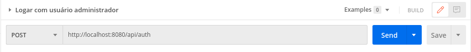

Vamos enviar um body no formato json com email e senha.

``` json
{
    "email": "admin@helpdesk.com",
    "password": "123456"
}
```

## Inserir um usuário e definindo qual o seu tipo de permissão

Para inserir um outro usuário vamos utilizar um endpoint diferente do usuário admin.

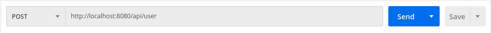

Logo após vamos inserir uma key do tipo Authorization no header, copiar o token gerado para o administrador e inserir no value do Authorization para poder ter permissão de inserir o usuário.

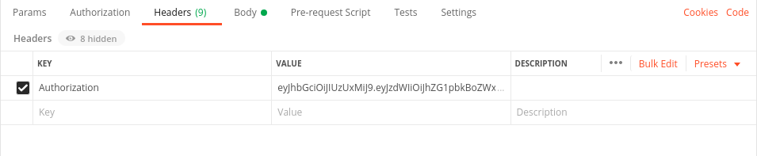

Vamos então passar o body do tipo json e fazer o envio da requisição.

``` json
{
    "email": "customer@gmail.com",
    "password": "123456",
    "profile": "ROLE_CUSTOMER"
}
```

## Alterar um usuário

Para alterar os dados de um usuário vamos utilizar o método ```POST```.

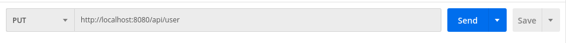

Vamos passar também o Authorization e o token como da mesma forma que no método anterior.


E no bory vamos adicionar o id juntamente com as alteraçõs desejadas.

```json
{
    "id": "5f7f25b870fba57ff2d29788",
    "email" : "andresonz@hotmail.com",
    "password" : "123456",
    "profile" : "ROLE_ADMIN"
}
```


## Buscar um usuário pelo id

Para fazer a busca vamos usar o método ```GET``` e passar o valor do id na url.

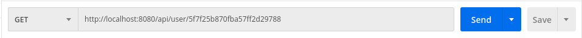

Vamos passar o Authorization e o token no header para podermos ter permissão de fazer a busca.

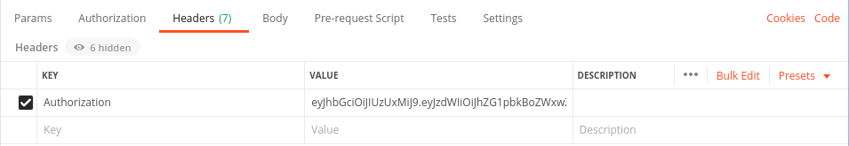


## Deletar um usuário

Para excluir um usuário vamos usar o método ```DELETE``` e passar o valor do id na url, assim como no método anterior.

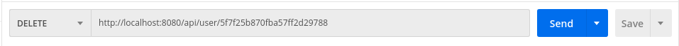

Vamos passar o Authorization e o token no header para podermos ter permissão de deletar.


## Listar todos os usuários

Para listar vamos usar o método ```GET``` novamente e passar na url o valor "/0/10", onde serão exibidos 10 registros da primeira página.

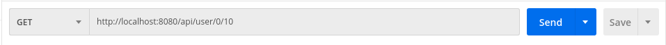

Vamos passar o Authorization e o token no header para podermos ter permissão de fazer a listagem.


## Criar um ticket

Para inserir um ticket vamos fazer um ```POST``` no seguinte endpoint.

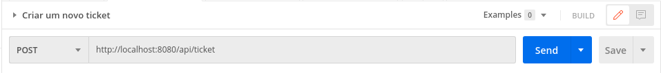

Devemos passar o token do usuário logado no header.

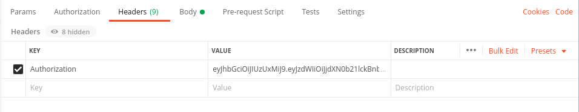

E no body um json com as informações do ticket.

```json
{
    "title" : "Test Ticket 1",
    "priority" : "Normal",
    "description" : "Test Description",
    "image" : "byte test"
}
```

## Alterar um ticket

Para alterar um ticket vamos usar o método ```PUT```.


Precisamos passar o header como em todos os outros métodos.

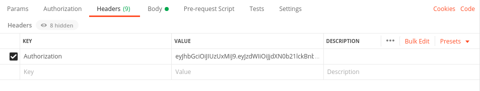

No body devemos passar o id do ticket que será alterado.

```json
{
    "id": "5f7fd5a80c51ed18695c6279",
    "title" : "Test Ticket Changed 1",
    "priority" : "Normal",
    "description" : "Test Description Changed",
    "image" : "byte test"
}
```

## Buscar um ticket por id

Vamos usar o ```GET``` passando o id na url.


Precisamos passar o header como em todos os outros métodos.


## Deletar um ticket

Vamos usar o método ```DELETE``` passando o id do ticket a ser apagado.

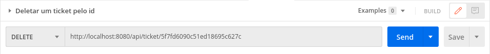

Precisamos passar o header como em todos os outros métodos.


## Listar todos os tickets passando uma página

Vamos usar o métogo ```GET``` passando a página e a quantidade de tickes.

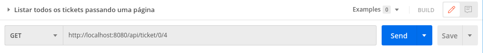

Precisamos passar o header como em todos os outros métodos.

