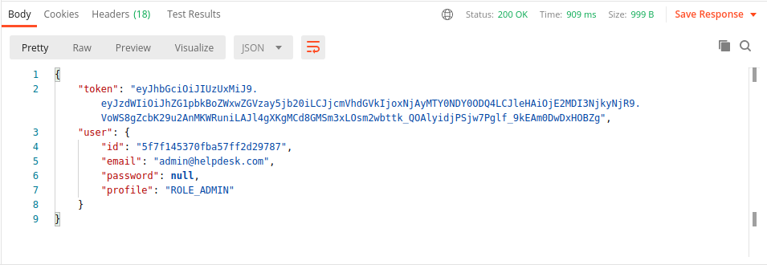
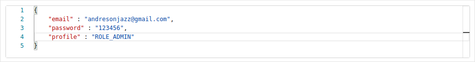
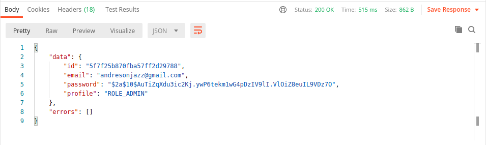
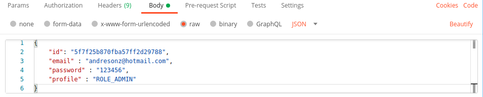
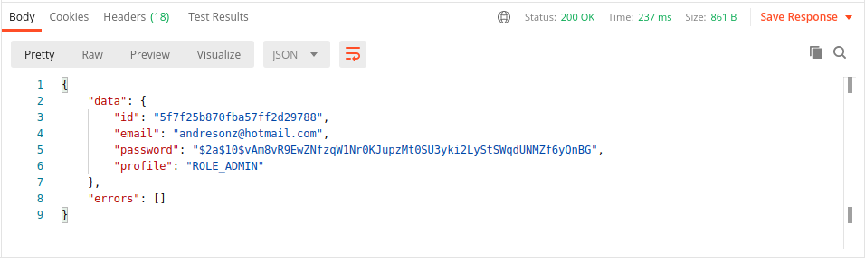
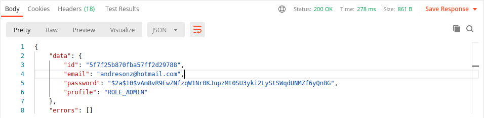
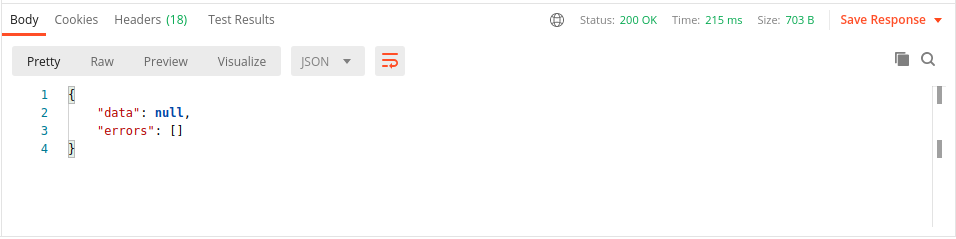
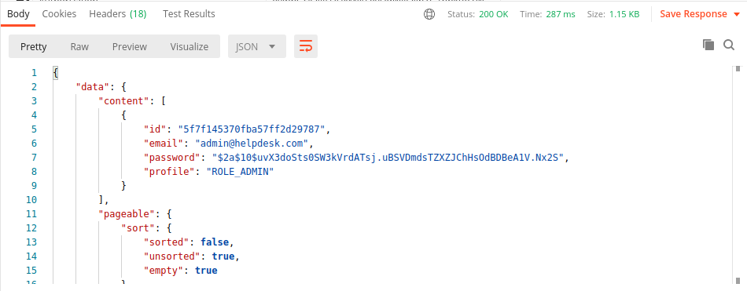

# Help Desk Api

## Inserir o usuário administrador

A inserção do usuário admin do sistema pode ser feita da seguinte forma.

Selecionamos o método post e definimos o endpoint.


Vamos enviar um body no formato json com email e senha.

``` json
{
    "email": "admin@helpdesk.com",
    "password": "123456"
}
```

A resposta deverá ser algo do tipo.



## Inserir um usuário e definindo qual o seu tipo de permissão

Para inserir um outro usuário vamos utilizar um endpoint diferente do usuário admin.


Logo após vamos inserir uma key do tipo Authorization no header, copiar o token gerado para o administrador e inserir no value do Authorization para poder ter permissão de inserir o usuário.


Vamos então passar o body do tipo json e fazer o envio da requisição.



O retorno deverá ser algo do tipo.



## Alterar um usuário

Para alterar os dados de um usuário vamos utilizar o método ```POST```.


Vamos passar também o Authorization e o token como da mesma forma que no método anterior.


E no bory vamos adicionar o id juntamente com as alteraçõs desejadas.



A resposta deverá ser algo parecido com a imagem abaixo.



## Buscar um usuário pelo id

Para fazer a busca vamos usar o método ```GET``` e passar o valor do id na url.


Vamos passar o Authorization e o token no header para podermos ter permissão de fazer a busca.


A resposta deverá ser algo do tipo.



## Deletar um usuário

Para excluir um usuário vamos usar o método ```DELETE``` e passar o valor do id na url, assim como no método anterior.


Vamos passar o Authorization e o token no header para podermos ter permissão de deletar.


A resposta deverá ser algo do tipo.



## Listar todos os usuários

Para listar vamos usar o método ```GET``` novamente e passar na url o valor "/0/10", onde serão exibidos 10 registros da primeira página.


Vamos passar o Authorization e o token no header para podermos ter permissão de fazer a listagem.


A resposta deverá ser algo do tipo.

